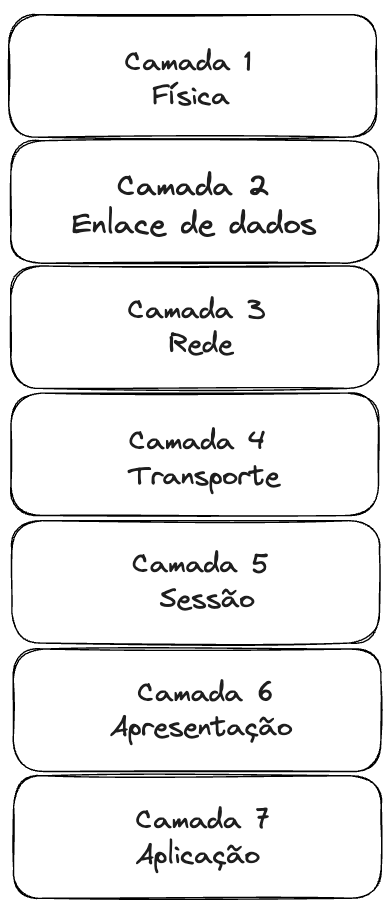

## Modelo OSI

Em 1983 a **International Organization for Standardization/Organização Internacional de Padronização (ISO)** criou o modelo chamado **Open System Interconnections/Sistema aberto de Interconexões (OSI)**. O modelo OSI é um conjunto de padrões e protocolos de comunicação entre diferentes computadores.

A necessidade de criar esse modelo veio com o avanço de diversas tecnologias e ao surgimento da internet o que permitiu a transferencia de dados em alta escala.

O principal motivo da OSI é fornecer um modelo de comunicação que tenham regras e diretrizes capazes de acompanhar constantes mudanças.

O modelo é dividido em 7 camadas e cada uma delas define um conjunto de regras para a comunicação daquele nível.

### Camadas OSI - OSI Layers

O modelo OSI foi desenvolvido para dividir o trabalho em diferentes níveis da rede, com cada nível possuindo padrões específicos que regulam a comunicação naquela camada. Essas camadas ajudam a estabelecer uma hierarquia de protocolos para a comunicação de redes locais e a internet aberta.

A camada mais alta do modelo, a camada de **aplicativo**, que utiliza vários protocolos em nível de aplicativo para a comunicação. A camada mais baixa chamada de camada **física** é onde os dados são transferidos em bits.

Cada camada é capaz de receber informações e passá-las para a próxima camada da pilha de protocolos, adicionando as informações de controle a mensagens e transmitindo-as através de uma interface. A camada de origem determina a camada de destino final lá no receptor.

