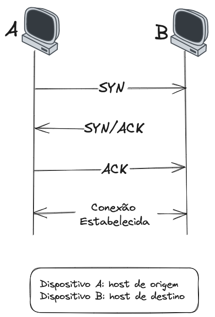

## Via de três mãos ou aperto de mãos de três vias

O Three-way handshake é um processo de estabelecimento de conexão entre dois dispositivos em uma rede e envolve três passos:

![[hosts-three-way]]
- 1º passo: o dispositivo *A* envia uma mensagem solicitando uma conexão que se chama *"SYN" (de synchronize/sincronização)* para o dispositivo *B*;
- 2º passo: o dispositivo *B* envia uma mensagem confirmando a conexão, chamada de *"SYN/ACK" (synchroniza-acknowledgn/sincronizar-conhecer)* em resposta a mensagem *SYN* do dispositivo *A*;
- 3º passo: o dispositivo *A* envia uma mensagem de confirmação chamada de *"ACK"* (acknowledge/conhece) em resposta a mensagem *SYN/ACK* do dispositivo *B*.

Com isso, a conexão é estabelecida e os dois dispositivos podem começar a trocar dados. O *three-way handshake* é uma parte importante da confiabilidade do TCP, pois garante que ambos os dispositivos estejam cientes de que a conexão foi estabelecida antes de começar a trocar dados.

[[05 - O que é um protocolo?]]
[[07 - TCP IP Model]]
[[07.1 - Ainda sobre TCP IP]]